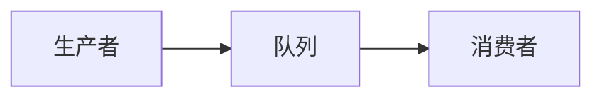
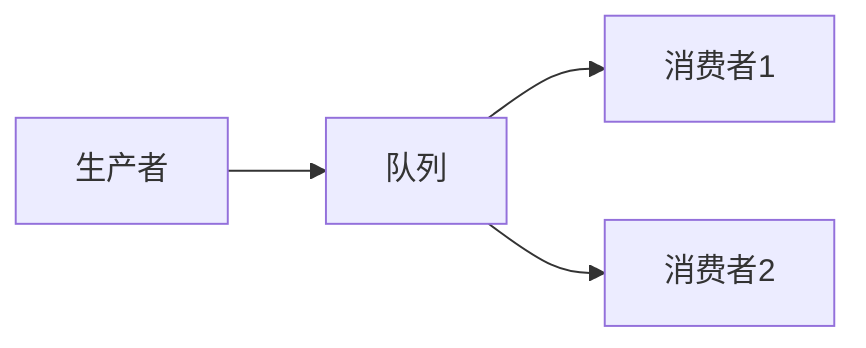
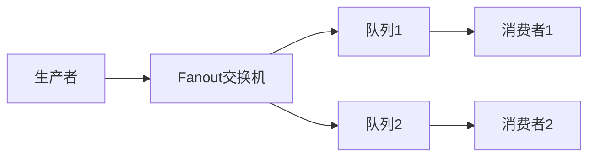
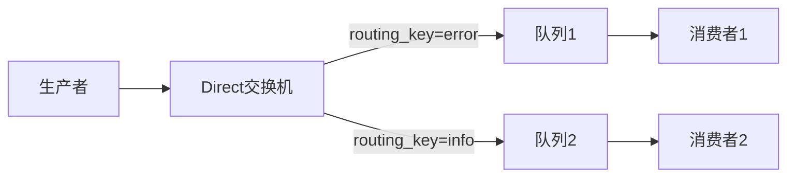
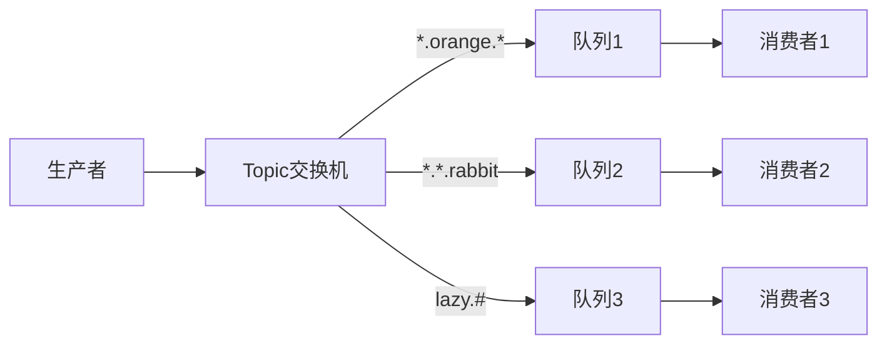

# 消息队列

消息队列使用先进先出的数据格式 , 不使用队列的情况下,生产者与消费者之间是通过RPC交互的

## 作用

### 解耦

使用消息队列解耦，系统的耦合性就会下降了。比如物流系统发生故障，需要几分钟才能修复，在这段时间内，物流系统要处理的数据被缓存到消息队列中，用户的下单操作正常完成。当物流系统恢复后，补充处理存在消息队列中的订单消息即可，终端系统感知不到物流系统发生过几分钟故障
 
### 削峰

一般情况，为了保证系统的稳定性，如果系统负载超过阈值，就会阻止用户请求，而如果使用消息队列将请求缓存起来，等待系统处理完毕后通知用户下单完毕，这方法虽然会耗时，但防止了系统不能下单的情况

### 数据分发

通过消息队列可以让数据在多个系统之间更加方便流通。只需要将数据发送到消息队列，数据使用方直接在消息队列中获取数据。例如：A系统产生数据，发送到MQ, BCD哪个系统需要，自己去MQ消费；如果某个系统不需要数据，可取消对MQ消息的消费；新系统要数据，直接从MQ消费

### 异步处理

用户注册后，需要发注册邮件和注册短信。传统的做法有两种：串行方式和并行方式

- 串行方式：将注册信息写入数据库成功后，发送注册邮件，再发送注册短信。以上三个任务完成后，返回给客户端
- 并行方式：将注册信息写入数据库成功后，发送注册邮件的同时，发送注册短信。以上三个任务完成后，返回给客户端

与串行的差别是，并行的方式可以提高处理的时间

例如：假设三个业务节点每个使用50毫秒，不考虑网络等其他开销，则串行方式的时间是150毫秒，并行的时间可能是100毫秒，因为cpu在单位时间内处理的请求数是一定的，假设cpu1秒吞吐量是100次，则串行方式1秒内cpu可处理的请求量是7次(1000/150)，并行方式处理的请求量是10次(1000/100)。

小结：根据如上案例，传统的方式系统的性能，如并发量、吞吐量、响应量等会有瓶颈

解决：使用消息队列

按照以上约定，用户的响应时间相当于是注册消息写入数据库时间，也就是50毫秒。注册邮件，发送短信写入消息队列后，直接返回，因为写入消息队列的速度很快基本可以忽略，因此用户响应时间可能是50毫秒。因此架构改变后，系统的吞吐量提高到每秒20 QPS，比串行提高了3倍，比并行提高了2倍

### 日志处理

日志处理是指将消息队列用在日志处理中，比如kafka的应用，解决大量日志传输的问题，架构简化如下,日志采集客户端，负责日志数据采集，定时写入kafka队列。kafka消费队列，负责日志数据的接收，存储和转发日志处理，订阅并消费kafka队列中的日志数据

## RocketMQ

### RocketMQ核心概念

- Producer
  消息生产者，可以集群部署。它会先和NameServer集群中的随机一台建立长连接，得知当前要发送的Topic存在哪台Broker Master上，然后再与其建立长连接，支持多种负载平衡模式发送消息。
- Consumer
  消息消费者，也可以集群部署。它也会先和NameServer集群中的随机一台建立长连接，得知当前要消费的Topic存在哪台Broker Master、Slave上，然后它们建立长连接，支持集群消费和广播消费消息。
- Broker
  主要负责消息的存储、查询消费，支持主从部署。存储topic的信息，接受生产者产生的消息，持久化消息。一个 Master可以对应多个Slave，Master支持读写，Slave只支持读。Broker会向集群中的每一台NameServer注册自己的路由信息。
- NameServer
  是一个很简单的Topic路由注册中心，支持Broker的动态注册和发现，保存Topic和Borker之间的关系。通常也是集群部署，但是各NameServer之间不会互相通信，各NameServer都有完整的路由信息，即无状态。
- topic（主题）
  可以理解为一个消息的集合的名字，生产者在发送消息的时候需要指定发到哪个topic下，消费者消费消息的时候也需要知道自己消费的是哪些topic底下的消息。
- Tag（子主题）
  比topic低一级，可以用来区分同一topic下的不同业务类型的消息，发送消息的时候也需要指定。

### 工作流程

1. Broker启动的时候，会往每台NameServer（因为NameServer之间不通信，所以每台都得注册）注册自己的信息，这些信息包括自己的ip和端口号，自己这台Broker有哪些topic等信息。
2. Producer在启动之后会跟NameServer建立连接，定期从NameServer中获取Broker的信息，当发送消息的时候，会根据消息需要发送到哪个topic去找对应的Broker地址，如果有的话，就向这台Broker发送请求；没有找到的话，就看根据`是否允许自动创建topic`来决定是否发送消息。
3. Broker在接收到Producer的消息之后，会将消息存起来，持久化，如果有从节点的话，也会主动同步给从节点，实现数据的备份
4. Consumer启动之后也会跟NameServer建立连接，定期从NameServer中获取Broker和对应topic的信息，然后根据自己需要订阅的topic信息找到对应的Broker的地址，然后跟Broker建立连接，获取消息，进行消费

<div className="mdx-div-img-50">

</div>

### Linux环境搭建RocketMQ

通过上面分析，我们知道，在RocketMQ中有NameServer、Broker、Producer、Consumer四种角色。而Producer和Consumer实际上就是业务系统，所以这里不需要搭建，真正要搭建的就是NameServer和Broker，但是为了方便RocketMQ数据的可视化，这里我多搭建一套可视化的服务。

#### 搭建NameServer

1. 修改jvm参数：
    ```shell 
    vim bin/runserver.sh -server -Xms512m -Xmx512m -Xmn256m -XX:MetaspaceSize=32m -XX:MaxMetaspaceSize=50m
    ```
2. 启动NameServer：
- 本地部署(linux)：
    ```shell
    nohup sh bin/mqnamesrv &
    ```
- 外网部署：
    ```shell
    nohup sh bin/mqnamesrv  -n "192.168.33.100:9876" &
    ```
3. 查看NameServer日志
    ```shell
    tail -f ~/logs/rocketmqlogs/namesrv.log
    ```

#### 搭建Broker

1. 修改jvm参数
    ```shell
    vim bin/runbroker.sh -server -Xms1g -Xmx1g -Xmn512m
    ```
2. 修改Broker配置文件：
    ```shell title="vim conf/broker.conf"
    namesrvAddr = localhost:9876
    brokerIP1 = 192.168.200.143
    brokerIP2 = 192.168.200.143
    ```
3. 启动Broker：
- 本地部署(linux)
    ```shell
    nohup sh bin/mqbroker -c conf/broker.conf &
    ```
- 外网部署
    ```shell
    nohup sh bin/mqbroker -n localhost:9876 -c conf/broker.conf &
    ```
4. 查看Broker日志
    ```shell
    tail -f ~/logs/rocketmqlogs/broker.log
    ```

#### 搭建可视化控制台

1. 启动可视化
    ```shell
    nohup java -jar -server -Xms256m -Xmx256m -Drocketmq.config.namesrvAddr=localhost:9876 -Dserver.port=8088 rocketmq-console-ng-1.0.1.jar &
    ```
2. 查看日志
    ```shell
    tail -f ~/logs/consolelogs/rocketmq-console.log
    ```

#### RocketMQ关闭

1. 关闭NameServer
    ```shell
    sh mqshutdown namesrv
    ```
2. 关闭Broker
    ```shell
    sh mqshutdown broker
    ```

### Window环境搭建

1. 下载包
    ```shell
    https://rocketmq.apache.org/release_notes/release-notes-4.9.2/
    ```
2. 配置环境变量
    ```shell
    ROCKETMQ_HOME = D:\rocketmq-4.9.2
    ```
3. 启动NameServer
    ```shell
    start mqnamesrv.cmd
    ```
4. 启动broker
    ```shell
    start mqbroker.cmd -n 127.0.0.1:9876 autoCreateTopicEnable=true
    ```
5. 下载控制台代码
    ```shell
    https://github.com/apache/rocketmq-dashboard
    ```

### Springboot集成

```xml
<!--rocketMQ-->
<dependency>
    <groupId>org.apache.rocketmq</groupId>
    <artifactId>rocketmq-spring-boot-starter</artifactId>
    <version>2.2.3</version>
</dependency>
```

```java
@Resource
private RocketMQTemplate rocketMqTemplate;
public void send() {
    rocketMqTemplate.convertAndSend("hmhTopic", "hmh的java日记");
}

@Component
@RocketMQMessageListener(consumerGroup = "hmhConsumer", topic = "hmhTopic")
public class SanYouTopicListener implements RocketMQListener<String> {
    @Override
    public void onMessage(String msg) {
        System.out.println("处理消息:" + msg);
    }
}
```

### 三种发送消息方式

| 发送方式 | 发送TPS | 发送结果反馈 | 可靠性   |
| -------- | ------- | ------------ | -------- |
| 同步发送 | 快      | 有           | 不丢失   |
| 异步发送 | 快      | 有           | 不丢失   |
| 单向发送 | 最快    | 无           | 可能丢失 |

#### 同步发送

```java
// Instantiate with a producer group name.
DefaultMQProducer producer = new DefaultMQProducer("please_rename_unique_group_name");
// Specify name server addresses.
producer.setNamesrvAddr("192.168.33.100:9876");
// Launch the instance.
producer.start();
// Call send message to deliver message to one of brokers.
SendResult sendResult = producer.send(msg);
System.out.printf("%s%n", sendResult);
// Shut down once the producer instance is not longer in use.
producer.shutdown();
```

#### 异步发送

```java
//Instantiate with a producer group name.
DefaultMQProducer producer = new DefaultMQProducer("example_group_name");
//Launch the instance.
producer.start();
producer.setRetryTimesWhenSendAsyncFailed(0);
producer.send(msg, new SendCallback() {
    public void onSuccess(SendResult sendResult) {
        System.out.printf("%-10d OK %s %n", index,sendResult.getMsgId());
    }
    public void onException(Throwable e) {
        System.out.printf("%-10d Exception %s %n", index, e);
        e.printStackTrace();
    }
});
//Shut down once the producer instance is not longer in use.
producer.shutdown();
```

#### 单向发送

```java
//Instantiate with a producer group name.
DefaultMQProducer producer = new DefaultMQProducer("example_group_name");
//Launch the instance.
producer.start();
//Call send message to deliver message to one of brokers.
producer.sendOneway(msg);
//Shut down once the producer instance is not longer in use.
producer.shutdown();
```

## RabbitMQ

### Windows环境搭建

1. 下载Erlang的OPT 25
    ```shell
    https://erlang.org/download/otp_versions_tree.html
    ```
2. 下载RabbitMQ的3.10.5版本
    ```shell
    https://github.com/rabbitmq/rabbitmq-server/releases
    ```
3. 启动管理功能
    ```shell
    rabbitmq-plugins enable rabbitmq_management
    ```
4. 访问地址查看是否安装成功
    ```shell
    http://localhost:15672/
    ```

### Linux环境搭建

#### 安装Erlang

1. 安装wget
    ```shell
    yum install -y wget
    ```
2. 安装依赖项
    ```shell
    yum install -y make gcc gcc-c++ kernel-devel m4 ncurses-devel openssl-devel
    ```
3. 配置安装源
    ```shell
    wget https://github.com/rabbitmq/erlang-rpm/releases/download/v25.3.4.15/erlang-25.3.4.15-1.el7.x86_64.rpm

    rpm -Uvh erlang-25.3.4.15-1.el7.x86_64.rpm
    ```
4. 安装Erlang
    ```shell
    yum install -y erlang
    ```
5. 验证是否安装成功
    ```shell
    erl -version
    ```

#### 安装RabbitMQ

1. 配置安装源
    ```shell
    wget https://github.com/rabbitmq/rabbitmq-server/releases/download/v3.7.9/rabbitmq-server-3.7.9-1.el7.noarch.rpm

    rpm --import https://www.rabbitmq.com/rabbitmq-signing-key-public.asc
    ```
2. 安装RabbitMQ
    ```shell
    yum install rabbitmq-server-3.7.9-1.el7.noarch.rpm
    ```
3. 启动RabbitMQ
    ```shell
    sudo /sbin/service rabbitmq-server start
    ```
4. 查看状态
    ```shell
    sudo /sbin/service rabbitmq-server status
    ```

#### 安装管理界面

1. 安装web插件
    ```shell
    sudo rabbitmq-plugins enable rabbitmq_management
    ```
2. 开放远程访问权限(将loopback_users对应的值，改为[]即可)
    ```shell
    vim /usr/lib/rabbitmq/lib/rabbitmq_server-3.7.9/ebin/rabbit.app
    ```

#### 配置RabbitMQ

1. 创建帐号并设置其角色为管理员（Admin ==> Users）
2. 创建一个新的虚拟host（Admin ==> Virtual Hosts）
3. 点击用户进入用户配置页面
4. 给用户配置该虚拟host的权限（Set Permission ==> Virtual Hosts）

### Springboot集成

```xml
<!--Spring AMQP依赖-->
<dependency>
    <groupId>org.springframework.boot</groupId>
    <artifactId>spring-boot-starter-amqp</artifactId>
</dependency>
```

```yaml
spring:
  rabbitmq:
    host: localhost
    port: 5672
    virtual-host: /mall
    username: mall
    password: mall
    publisher-confirm-type: correlated
    # publisher-confirms: true #消息发送到交换器确认
    publisher-returns: true #消息发送到队列确认
```

### 7种消息模式

#### 简单模式

简单模式是最简单的消息模式，它包含一个生产者、一个消费者和一个队列。生产者向队列里发送消息，消费者从队列中获取消息并消费



#### 工作模式(Work Queues)

工作模式是指向多个互相竞争（竞争消费）的消费者发送消息的模式，它包含一个生产者、两个消费者和一个队列。两个消费者同时绑定到一个队列上去，当消费者获取消息处理耗时任务时，空闲的消费者从队列中获取并消费消息



#### 发布/订阅模式(Publish/Subscribe)

发布/订阅模式是指同时向多个消费者发送消息的模式（类似广播的形式），它包含一个生产者、两个消费者、两个队列和一个`fanout 类型交换机`。两个消费者同时绑定到不同的队列上去，两个队列绑定到交换机上去，生产者通过发送消息到交换机，所有消费者接收并消费消息



#### 路由模式(Routing)

路由模式是可以根据路由键选择性给多个消费者发送消息的模式，它包含一个生产者、两个消费者、两个队列和一个`direct 类型的交换机`。两个消费者同时绑定到不同的队列上去，两个队列通过路由键绑定到交换机上去，生产者发送消息到交换机，交换机通过`routing key`有选择性地将消息发送到相应的队列，队列绑定的消费者接收并消费消息



#### 通配符模式(Topics)

支持模糊匹配的路由模式

- `*`：只能匹配一个单词
  - `*.*.rabbit`: 匹配第三个单词是rabbit的消息
- `#`：可以匹配零个或多个单词
  - `lazy.#`: 匹配所有以lazy开头的消息
- `.`：单词之间用`.`分隔
  - `*.orange.*`: 匹配第二个单词是orange的消息



#### RPC

#### Publisher Confirms

## MQTT

```sql
-- 新版规则
SELECT * FROM "l3/s/n/#"WHERE payload.method in ('facePicRegResult')

-- 旧版规则
SELECT * FROM "message.publish" WHERE topic =~ 'l3/s/n/#' and payload.method in ('facePicRegResult')
```

### 遗嘱

- 连接mqtt配置时设置：`options.setWill("willTopic", "offline", 2, false)`
- 监听遗嘱的服务器订阅：`topic：willTopic`

## Kafka

### Kafka核心概念

- Producer
  消息生产者,负责发布消息到Kafka broker。
- Consumer
  消息消费者,从Kafka broker读取消息的客户端。
- Broker
  Kafka集群包含一个或多个服务器,每个服务器就是一个broker。一个broker可以容纳多个topic。
- Topic
  可以理解为一个队列,生产者和消费者面向的都是一个topic。
- Partition
  为了实现扩展性,一个非常大的topic可以分布到多个broker上,一个topic可以分为多个partition。
- Consumer Group
  每个Consumer属于一个特定的Consumer Group,一条消息只能被Consumer Group中的一个Consumer消费,但可以被多个Consumer Group消费。

### 工作流程

1. Producer发送消息到broker时,会根据Partition机制选择将其存储到哪一个Partition。
2. 在Consumer Group中,一个Partition只能被一个Consumer消费。
3. Consumer Group订阅topic时,会平均分配partition。例如一个topic有4个partition,那么一个consumer group中的2个consumer,每个consumer会分配到2个partition。
4. 当Consumer Group中有Consumer增加或删除时,会触发Rebalance机制。

### Linux环境搭建Kafka

#### 安装ZooKeeper

1. 下载ZooKeeper:
    ```shell
    wget https://archive.apache.org/dist/zookeeper/zookeeper-3.7.0/apache-zookeeper-3.7.0-bin.tar.gz
    ```
2. 解压并重命名:
    ```shell
    tar -zxvf apache-zookeeper-3.7.0-bin.tar.gz
    mv apache-zookeeper-3.7.0-bin zookeeper
    ```
3. 修改配置:
    ```shell
    cd zookeeper/conf
    cp zoo_sample.cfg zoo.cfg
    ```
4. 启动ZooKeeper:
    ```shell
    bin/zkServer.sh start
    ```

#### 安装Kafka

1. 下载Kafka:
    ```shell
    wget https://archive.apache.org/dist/kafka/2.8.0/kafka_2.13-2.8.0.tgz
    ```
2. 解压:
    ```shell
    tar -xzf kafka_2.13-2.8.0.tgz
    mv kafka_2.13-2.8.0 kafka
    ```
3. 修改配置文件:
    ```shell title="config/server.properties"
    broker.id=0
    listeners=PLAINTEXT://localhost:9092
    zookeeper.connect=localhost:2181
    ```
4. 启动Kafka:
    ```shell
    bin/kafka-server-start.sh -daemon config/server.properties
    ```

### Springboot集成

```xml
<dependency>
    <groupId>org.springframework.kafka</groupId>
    <artifactId>spring-kafka</artifactId>
</dependency>
```

```yaml
spring:
  kafka:
    bootstrap-servers: localhost:9092
    producer:
      # 发生错误后，消息重发的次数。
      retries: 0
      #当有多个消息需要被发送到同一个分区时，生产者会把它们放在同一个批次里。该参数指定了一个批次可以使用的内存大小，按照字节数计算。
      batch-size: 16384
      # 设置生产者内存缓冲区的大小。
      buffer-memory: 33554432
      # 键的序列化方式
      key-serializer: org.apache.kafka.common.serialization.StringSerializer
      # 值的序列化方式
      value-serializer: org.apache.kafka.common.serialization.StringSerializer
    consumer:
      # 自动提交的时间间隔 在spring boot 2.X 版本中这里采用的是值的类型为Duration 需要符合特定的格式，如1S,1M,2H,5D
      auto-commit-interval: 1S
      # 该属性指定了消费者在读取一个没有偏移量的分区或者偏移量无效的情况下该作何处理：
      # latest（默认值）在偏移量无效的情况下，消费者将从最新的记录开始读取数据（在消费者启动之后生成的记录）
      # earliest ：在偏移量无效的情况下，消费者将从起始位置读取分区的记录
      auto-offset-reset: earliest
      # 是否自动提交偏移量，默认值是true,为了避免出现重复数据和数据丢失，可以把它设置为false,然后手动提交偏移量
      enable-auto-commit: false
      # 键的反序列化方式
      key-deserializer: org.apache.kafka.common.serialization.StringDeserializer
      # 值的反序列化方式
      value-deserializer: org.apache.kafka.common.serialization.StringDeserializer
```

```java
@Component
public class KafkaProducer {
    @Autowired
    private KafkaTemplate<String, String> kafkaTemplate;
    
    public void send(String topic, String message) {
        kafkaTemplate.send(topic, message);
    }
}

@Component
public class KafkaConsumer {
    @KafkaListener(topics = "test-topic")
    public void listen(ConsumerRecord<?, ?> record) {
        System.out.println("收到消息：" + record.value());
    }
}
```

### 三种消息投递语义

| 投递语义 | 说明                             | 实现方式         |
| -------- | -------------------------------- | ---------------- |
| 最多一次 | 消息可能会丢失,但绝不会重复传递  | 发送完消息就提交 |
| 最少一次 | 消息绝不会丢失,但可能会重复传递  | 收到消息再提交   |
| 精确一次 | 每条消息肯定会被传输一次且仅一次 | 事务或幂等性     |

#### 幂等性实现
```java
// 开启幂等性
props.put("enable.idempotence", true);
// 设置重试次数
props.put("retries", 3);
```

#### 事务实现
```java
// 初始化事务
producer.initTransactions();
// 开启事务
producer.beginTransaction();
try {
    // 发送消息
    producer.send(record1);
    producer.send(record2);
    // 提交事务
    producer.commitTransaction();
} catch (Exception e) {
    // 中止事务
    producer.abortTransaction();
}
```