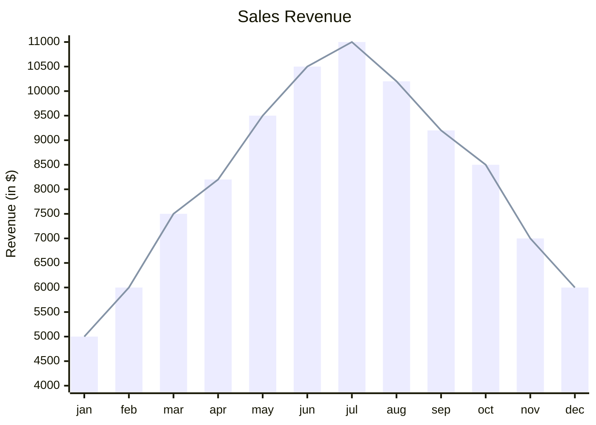

### 链接


#### 超级链接


[Link Text](https://support.typora.io/Links/) 


[Link Text](https://support.typora.io/Links/ "optional title")


#### 参考链接


[Link Text][https://support.typora.io/Links]


[Ref]: https://support.typora.io/Links	"optional title"


[https://support.typora.io/Links][]


[Ref]: https://support.typora.io/Links


#### 自动链接


`<https://support.typora.io/Links>`


#### 自动网址


> [!note]

>

> Typora 可以自动检测 Markdown 中的 url 链接，并将其渲染为 URL 链接，但请注意，其他 Markdown 引擎可能不支持此功能。


This is a link: https://support.typora.io/Links


#### `<a>`标签


<a href="https://support.typora.io/Links" target="__blank">Link to Link</a>


<a name="anchor">Anchor</a> 


<a href="#anchor">Link to Anchor</a>


### Github 风格警报/标注


> **所有五种类型的示例：**


```gfm

> [!NOTE]  

> Highlights information that users should take into account, even when skimming.


> [!TIP]

> Optional information to help a user be more successful.


> [!IMPORTANT]  

> Crucial information necessary for users to succeed.


> [!WARNING]  

> Critical content demanding immediate user attention due to potential risks.


> [!CAUTION]

> Negative potential consequences of an action.

```


### 序列图（Sequence Diagrams）


[序列图]: https://bramp.github.io/js-sequence-diagrams/


```sequence

Andrew->China: Says Hello

Note right of China: China thinks\nabout it

China-->Andrew: How are you?

Andrew->>China: I am good thanks!

```


### 流程图（Flowcharts）


[流程图]:https://flowchart.js.org/


```flow

st=>start: Start|past:>http://www.google.com[blank]

e=>end: End|future:>http://www.google.com

op1=>operation: My Operation|past

op2=>operation: Stuff|current

sub1=>subroutine: My Subroutine|invalid

cond=>condition: Yes

or No?|approved:>http://www.google.com

c2=>condition: Good idea|rejected

io=>inputoutput: catch something...|future


st->op1(right)->cond

cond(yes, right)->c2

cond(no)->sub1(left)->op1

c2(yes)->io->e

c2(no)->op2->e

```


### Mermaid


[Mermaid]:https://mermaid.js.org/#/


#### XY图表


[XY图表]: https://mermaid.js.org/syntax/xyChart.html





#### 序列图


### 数学和学术职能（Tex/LaTeX）


[数学和学术职能]:https://support.typora.io/Math/


#### 数学块（显示数学）

```
$$

\begin{align*}

y = y(x,t) &= A e^{i\theta} \\

&= A (\cos \theta + i \sin \theta) \\

&= A (\cos(kx - \omega t) + i \sin(kx - \omega t)) \\

&= A\cos(kx - \omega t) + i A\sin(kx - \omega t)  \\

&= A\cos \Big(\frac{2\pi}{\lambda}x - \frac{2\pi v}{\lambda} t \Big) + i A\sin \Big(\frac{2\pi}{\lambda}x - \frac{2\pi v}{\lambda} t \Big)  \\

&= A\cos \frac{2\pi}{\lambda} (x - v t) + i A\sin \frac{2\pi}{\lambda} (x - v t)

\end{align*}

$$
```


[https://support.typora.io/Links]: 
